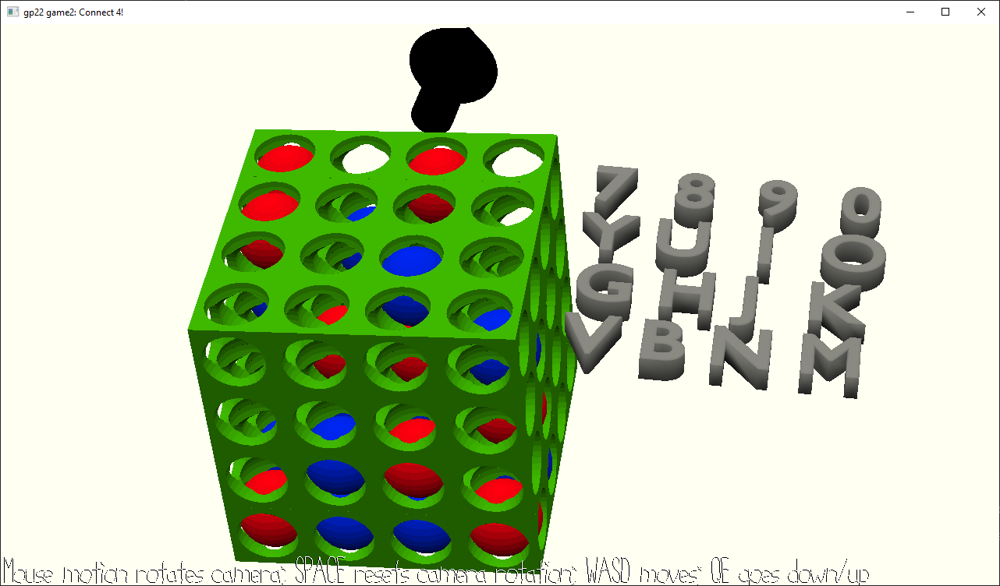

# Connect 4! (Factorial!)

Author: Alan Lee / soohyun3

Design: This is Connect 4!(factorial) ! This is a reimagination of Connect (4) in (3) dimensions with (2) people and (1) winner!

Screen Shot:

How To Play:

Use mouse to look around (rotate camera).

'WASD' to move camera front/left/down/right.

'QE' to move camera down/up.

'Space bar' to reset camera's rotation to initial rotation (if you are annoyed by your tilted camera angle).

'Escape key' to ungrab mouse.

 

Each of the entry to the 4x4x4 Connect 4! board is represented by

[7 8 9 0]

[Y U I O]

[G H J K]

[V B N M]

keys on your keyboard.

 

The game has a red player (player 1) and a blue player (player 2).

The game starts with red player first, and after each player's ball entry, the player swaps.

The first to connect 4 balls of one's color wins, but only horizontal / vertical connections count (no diagonal connections for the win).

 

This game was built with [NEST](NEST.md).
